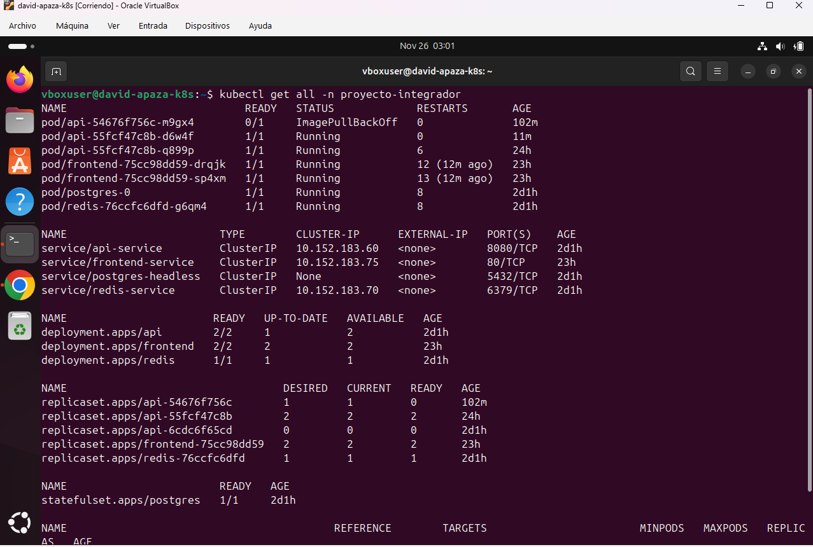
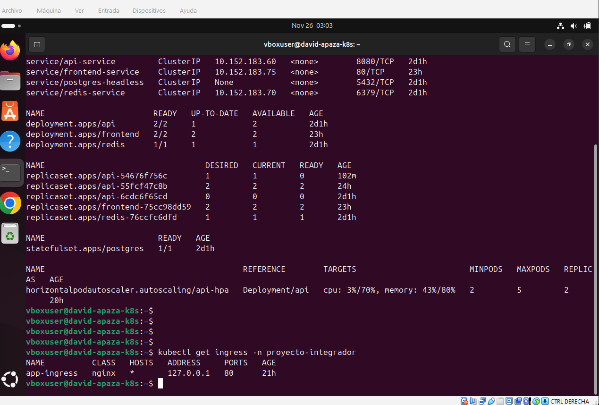
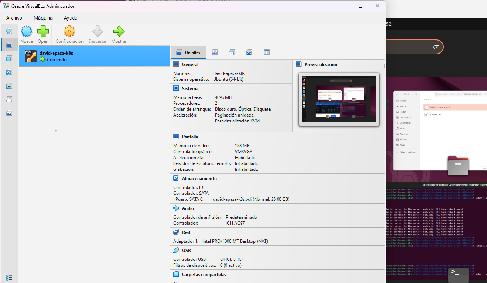

# Proyecto Final - Docker & Kubernetes

**Alumno:** [david apaza ticona]
**Fecha:** [25-11-2025]
**Curso:** Docker & Kubernetes - i-Quattro

> **Nota:** Este README debe describir cada parte con evidencias y comentarios en Markdown; recuerda que la documentación representa el 20% de la nota final.

## Links de Docker Hub
- Backend v2.1: https://hub.docker.com/r/tu-usuario/springboot-api/tags
- Frontend v2.2: https://hub.docker.com/r/tu-usuario/angular-frontend/tags

## Parte 1: Setup del Ambiente

**Ambiente utilizado:**
- [VirtualBox / VMware / AWS / GCP / Azure / DigitalOcean]
- Nombre de VM/Instancia: [tu-nombre-completo-k8s]
- Sistema operativo: Ubuntu 24.04 LTS
- Recursos: 4GB RAM, 2 CPU cores
- Red configurada: [NAT/Bridged o tipo de red en cloud]
- Rango MetalLB: [Tu rango de IPs]

### Screenshots

## Parte 2: Backend v2.1
[Descripción de cambios realizados]

### Código Agregado
[Snippet del endpoint /api/info]

### Screenshots

## Parte 3: Frontend v2.2
[Descripción de cambios en Angular]

### Screenshots

## Parte 4: Gestión de Versiones

### ¿Qué hace kubectl rollout undo?
[Tu explicación]

### Screenshots

## Parte 5: Ingress + MetalLB

**IP del Ingress:** [Tu IP de MetalLB]

### Screenshots

## Conclusiones

### Aprendizajes principales
- [Punto 1]
- [Punto 2]
- [Punto 3]

### Dificultades encontradas
- [Dificultad 1 y cómo la resolviste]
- [Dificultad 2 y cómo la resolviste]

### Reflexión
[¿Cómo aplicarías esto en un proyecto real?]